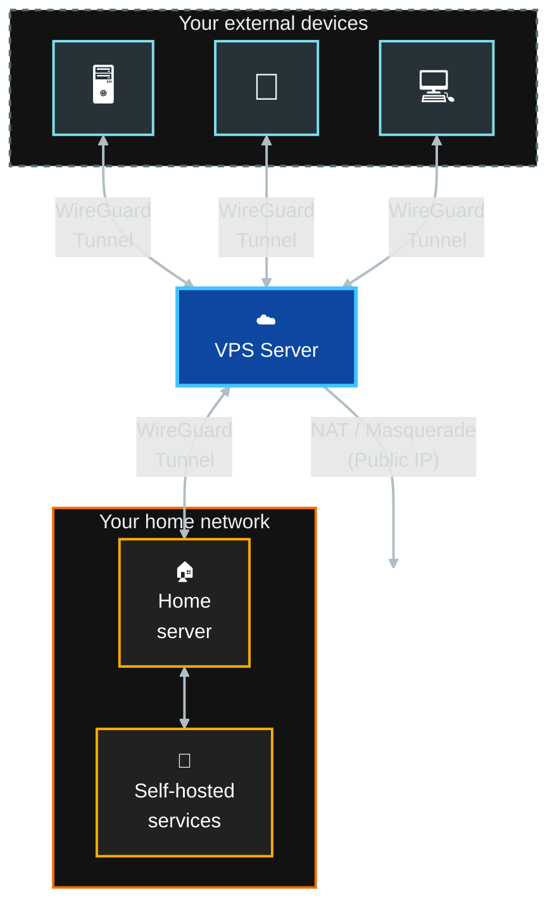

# WireGuard Hub on VPS

**A containerized WireGuard gateway designed to connect roaming devices with your home network, bypassing ISP restrictions like CGNAT.**

This repository automates the deployment of a WireGuard server on VPS environments (Oracle Cloud, AWS, Debian/Ubuntu). It handles the full stack: system network patching, Docker installation, and automated peer/QR code generation.



> [!IMPORTANT]
> **Network Host Mode**
>
> Unlike standard Docker deployments, this project runs WireGuard in `network_mode: host`.
>
> This is a deliberate choice to:
>
> - **Ensure Stability:** Bypass UDP Checksum Offloading bugs common in KVM/Oracle Cloud.
> - **Maximize Performance**
> - **Preserve Real IPs**

> [!NOTE]
> By default the tunnel only reaches the home server's own services, not your whole LAN. The home server peer's `AllowedIPs` on the VPS is scoped to its own tunnel IP (separate from the client `ALLOWEDIPS` env var below, which stays full-tunnel `0.0.0.0/0,::/0` on purpose). To bridge your full LAN, widen that peer's `AllowedIPs` to your LAN subnet specifically, never to `0.0.0.0/0`.

## Related documentation

This guide handles the **VPS Hub** (the central node). For the other parts of the infrastructure shown above, check the specific guides:

- **[💻📱 External client setup guide](CLIENTS.md):** How to connect your external devices (Phone, Laptop...) to this VPN.
- **[🏠👾 Home server services](SERVICES.md):** Guide for self-hosted services and applications running on your home server.

## Prerequisites

- VPS with Ubuntu/Debian OS
- SSH access to the server
- UDP port 51820 open

## Installation

### 1. Configure VPS Firewall

Access your VPS provider's firewall/security settings and:

- **OPEN UDP 51820 port** (Source: `0.0.0.0/0`)
- Ensure the server's network configuration allows host network mode

### 2. Clone the repository

Connect via SSH, clone this repository and enter the directory.

```bash
git clone https://github.com/ruizmaa/wireguard-docker-hub.git
cd wireguard-docker-hub
chmod +x wireguard.sh scripts/*.sh
```

### 3. Choose one of the following installation methods

#### A: 🚀 Quick Start (automated)

Recommended for fresh VPS installations. This script handles the full lifecycle: installs Docker, hardens SSH and removes the cloud image's default passwordless sudo, auto-detects your Public IP, updates configuration, starts the container, and applies network patches.

> [!WARNING]
> **Set a password for your user first.** Fresh cloud images (Oracle, AWS, etc.) typically create their default user with SSH-key-only login and **no password at all**, relying entirely on passwordless sudo (`NOPASSWD:ALL`) for admin access. This script removes that passwordless sudo. If it detects your user has no password to fall back on, it skips the removal and warns instead of locking you out, but you're then stuck with passwordless sudo until you set one and re-run it.
>
> ```bash
> sudo passwd "$USER"
> ```
>
> Run this and save the password before continuing, so the removal actually happens on the first pass.

```bash
sudo ./scripts/easy-install.sh
```

Once the installation finishes, you must log out and log back in to apply Docker permissions.

```bash
exit
ssh <USER>@<IP>
```

Now you can just connect your devices with the QR code.

```bash
./wireguard.sh qr 1
```

Or copy the configuration file to your device

```bash
./wireguard.sh conf-file 1
```

---

#### B: 🛠️ Manual / Modular Installation

Recommended if you want full control and customization

##### 1. Install Dependencies

Installs Docker and system tools, enables `fail2ban` for SSH brute-force protection, disables root SSH login, and enables `unattended-upgrades` for automatic security patches.

```bash
sudo ./scripts/basic-install.sh
```

##### 2. Configure

Copy `.env.example` to `.env` and set your `SERVERURL` (IP or Domain), `INTERNAL_SUBNET`, `PEERS`, `PEERDNS`, `TZ` and so more...

You can take a quick look at the [configuration section](#configuration) below or check the [image documentation](https://github.com/linuxserver/docker-wireguard).

```bash
cp .env.example .env
nano .env
```

##### 3. Apply Network Fixes

Start the container to generate keys and configuration files. Once the container is up and the configuration files are created, run this script to patch the host kernel settings, MTU, and Firewall rules.

> `sudo` is used here because the group permissions require a session refresh (see [Step 4](#4-refresh-session)).

```bash
sudo ./wireguard.sh start

# Wait for config generation
while [ ! -f "./config/wg_confs/wg0.conf" ]; do
    sleep 1
done

# Apply fixes
sudo ./scripts/fix-vps-net.sh
sudo ./wireguard.sh restart
```

##### 4. Refresh Session

To apply Docker permissions (use docker without sudo) and terminal fixes, you must log out and log back in.

```bash
exit
ssh <USER>@<IP>
```

##### 5. Connect your devices

Finally you can connect your devices.

```bash
# Get QR
./wireguard.sh qr 1

# Get configuration file
./wireguard.sh conf-file 1
```

## Configuration

The WireGuard interface is configured via environment variables, set in `.env` (copy `.env.example` to `.env` first, see [Configure](#2-configure)) and read by `docker-compose.yml`:

| Variable | Default | Description |
| :--- | :--- | :--- |
| `PUID` / `PGID` | `1000` | User and Group IDs. Should match the host user to avoid permission issues with volumes. |
| `TZ` | `Etc/UTC` | Timezone for the container logs (e.g., `Europe/Madrid`). |
| `SERVERURL` | `auto` | **Required.** External IP or Domain. The installation script sets this to your Public IP automatically. |
| `SERVERPORT` | `51820` | External UDP port. Must be open in your Cloud Provider's firewall. |
| `PEERS` | `1` | Number of peers to generate (e.g., `2`) or a list of names (e.g., `phone,laptop`). |
| `PEERDNS` | `auto` | DNS server for clients. If unset (`auto`), uses the container's CoreDNS. |
| `INTERNAL_SUBNET` | `10.13.13.0` | Internal VPN IP range. Change only if it clashes with your local network. |
| `ALLOWEDIPS` | `0.0.0.0/0,::/0` | Defines routing. `0.0.0.0/0` forces **Full Tunnel** for IPv4. `::/0` prevents IPv6 traffic from leaking outside the tunnel on clients with native IPv6. But the VPS itself doesn't configure IPv6 forwarding/NAT, so this blackholes IPv6 rather than routing it: IPv6-only destinations become unreachable instead of bypassing the VPN. |
| `PERSISTENTKEEPALIVE_PEERS` | `all` | Set to `all` (or a list of peers) to send "ping" packets every 25s to keep the tunnel open. |
| `LOG_CONFS` | `true` | If `true`, outputs the QR codes to the Docker logs on startup. |

> [!NOTE]
> The installer automatically writes `PUID`/`PGID`/`SERVERURL` to `.env` to match your system user and public IP.  
> If installing manually, set them to `id -u` / `id -g` in `.env` to avoid permission issues.

## Checking the hardening

`basic-install.sh` installs and enables `fail2ban` automatically, with an `sshd` jail that bans an IP for 1h after 5 failed attempts in 10 minutes, disables root SSH login (`PermitRootLogin no`), and enables `unattended-upgrades` for automatic security patches. No custom tooling needed to inspect any of it, the standard tools already cover it:

```bash
sudo fail2ban-client status sshd                # current/total ban counts, currently banned IPs
sudo fail2ban-client get sshd banip --with-time # banned IPs with time remaining
sudo grep ' Ban ' /var/log/fail2ban.log         # full history, including already-expired bans
sudo sshd -T | grep permitrootlogin             # confirm root login is disabled
sudo systemctl status unattended-upgrades       # confirm automatic security patches are enabled
```

## Keeping images up to date

`docker-compose.yml` (WireGuard) runs on the **VPS**. `services/docker-compose.yml` runs on the **home server**. Both pin specific image versions, and each machine deploys independently, a change to one compose file never touches the other machine. The flow:

1. **Dependabot** opens a PR whenever a newer version is published
2. **`Testing` workflow** runs on the PR. Safe to run on any fork's PR, since it uses a GitHub-hosted runner with no access to your infrastructure
3. **Review and merge** the PR.
4. On push to `main`, whichever deploy workflow matches the changed paths runs on its own self-hosted runner:
   - `Deploy WireGuard (VPS)` triggers only on changes to `docker-compose.yml` / `wireguard.sh`, and runs on the runner registered on the **VPS**.
   - `Deploy Services (Home server)` triggers only on changes under `services/`, and runs on the runner registered on the **home server**.

To apply an update manually instead of waiting for the next push (e.g. while testing), from the relevant machine:

```bash
./wireguard.sh update      # on the VPS
./services/update.sh       # on the home server
```

Both show `current -> new` per service and ask for confirmation before pulling and recreating. Pass `--yes` to skip the prompt.

`scripts/deploy-wireguard.sh` / `scripts/deploy-services.sh` are the non-interactive equivalents each deploy workflow runs (the matching entry point with `--yes`, plus `docker image prune -f`).

### Self-hosted runners

Register one on each machine, with a label so each workflow lands on the right one.

Go to Settings -> Actions -> Runners -> New self-hosted runner, pick the machine's OS/architecture, and follow GitHub's own instructions there (download, checksum, extract) up to and including `./config.sh ...`. **But add `--labels vps` or `--labels home` to that command**

Then, instead of the `./run.sh` GitHub suggests (which only runs while that terminal stays open), install it as a persistent service:

```bash
sudo ./svc.sh install   # survives reboots, restarts on crash
sudo ./svc.sh start     # starts it now
```

Do this on the vps server (`--labels vps`) and home server (`--labels home`).

Each runner polls GitHub outbound, so no inbound port needs to be opened on either machine.
